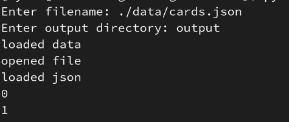

# mtg-hash-generation
Utility to create hashes of mtg cards

### opencv
Requires opencv
```
pip install opencv-python
```

### Running
When you run generate_hashes.py you will be prompted for a filename and an output directory, these are both relative filepaths from the python script.

An example run with the following filestructure

<!--  -->

- mtg-hash-generation
    - data
        - cards.json
    - output
        - set1.csv
        - set2.csv
        - set3.csv
        - ...
    - generate_hashes.py


#### Filename
This is asking for a bulk file download from [scryfall](https://scryfall.com/docs/api/bulk-data), it is recomended to use the "default Cards" file if not you are not sure which one you need.

#### Output directory
This is where the generated files will be stored

### Output
This script creates one file per set, this is set in the most general sense, a list can be found [here](https://mtg.fandom.com/wiki/Set). Each file is a csv containing headers, where the first column is the card's scryfall id and the second column is the card's 64 bit difference hash stored as a string of ones and zeroes.